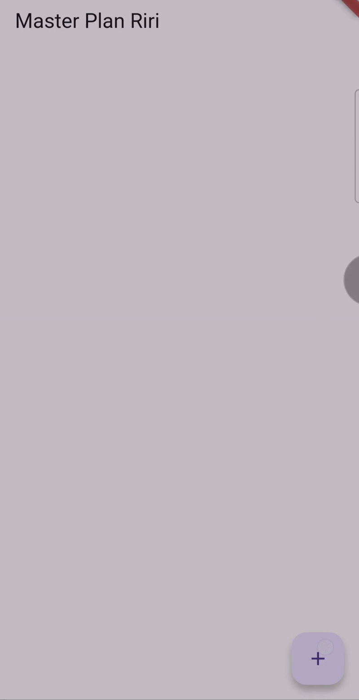
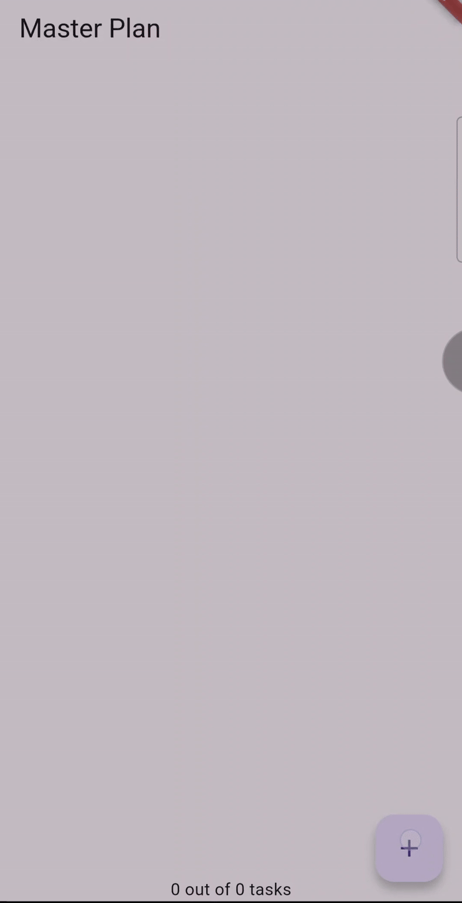
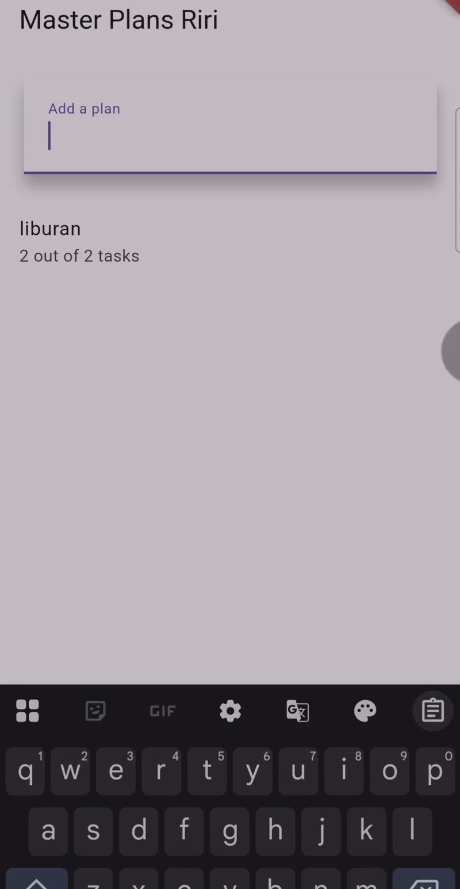

# Dasar State Management

Praktikum 1 

Ini adalah hasil akhir dari praktikum 1, dan telah dibuat aplikasi pencatatan tugas menggunakan Flutter dengan konsep manajemen state berbasis Model-View. pengguna bisa menambah dan menandai tugas sebagai selesai. Implementasi mencakup pembuatan model Task dan Plan, pengelolaan state dengan StatefulWidget, serta penggunaan ListView untuk menampilkan daftar tugas. Selain itu, ditambahkan fitur ScrollController untuk mengatasi kendala input pada perangkat iOS. 

Praktikum 2

 Ini adalah hasil akhir dari praktikum 2, dilakukan implementasi manajemen state di Flutter menggunakan InheritedWidget dan InheritedNotifier untuk mengelola data pada aplikasi Master Plan. bisa menambahkan daftar tugas, menandai tugas yang telah selesai, serta mengakses dan memperbarui data dari berbagai screen. Dengan memisahkan data dari UI, aplikasi menjadi lebih modular dan mudah dikelola. 

Praktikum 3

Ini adalah hasil dari praktikum 3 dan ini dapat mengelola state pada multiple screens dalam aplikasi Flutter dengan konsep Lift State Up. Dengan memodifikasi PlanProvider agar menangani daftar Plan, setiap rencana dapat diakses dari berbagai screen. pengguna bisa menambahkan, melihat, dan mengelola banyak daftar tugas dengan navigasi antar layar. Prosesnya melibatkan perubahan pada main.dart, plan_screen.dart, serta penambahan plan_creator_screen.dart untuk pembuatan daftar 